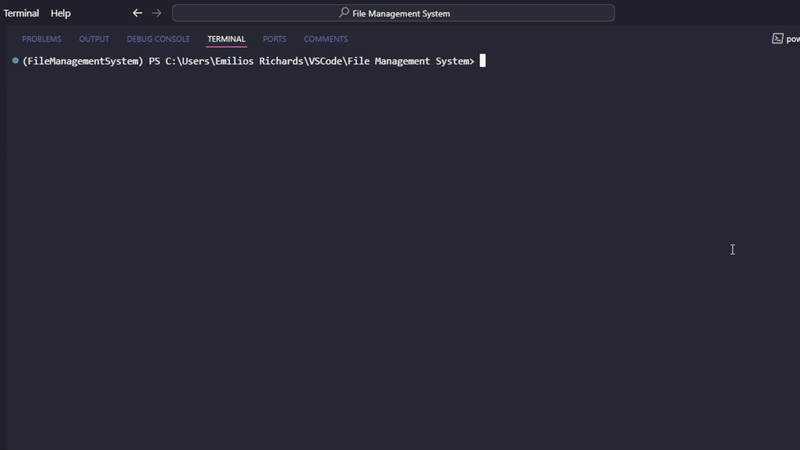

---


# File Management System Project

Welcome! This document outlines the development of a File Management System designed to manage and organize digital files efficiently. If you’re ready to start using the system, find out how [here](#installation-guide-for-file-management-system).


# Document Contents

- [**Installation Guide for File Management System**](#installation-guide-for-file-management-system): Walks through the steps needed to install and use the File Management System.
- [**Project Significance**](#project-significance): Explains what a File Management System is and the rationale behind building a custom version.
- [**Design Phase**](#design-phase-technical-insights): Outlines the initial design and planning stages of the project, focusing on the architectural decisions and technology choices made to support the development.
- [**Building Process**](#building-process): Details the steps taken in constructing the system, focusing on development strategies and implementation.
- [**Testing and Quality Assurance**](#testing-and-quality-assurance): Describes the testing methodologies and quality assurance processes used to ensure the system's reliability.
- [**Lessons Learned**](#lessons-learned): Reflects on the overall project experience, highlighting unexpected outcomes and key takeaways.
- [**Conclusion**](#conclusion): Provides a summary of the project, opportunities for contribution, and future directions for related work.

  
---


# Installation Guide for File Management System

Follow these steps to install and set up the File Management System on your computer:

**Prerequisites**

Before Installing, ensure you have the following software requirments: 

- Python 3.8 or Higher
- Git (for cloning repository)

### Installing 

**Step 1: Clone the Repository**

Start by cloning the repository from GitHub. Open your terminal or command prompt and run the following command:

```bash 
git clone https://github.com/EmiliosRichards/File-Management-System
```

**Step 2: Navigate to the Project Directory**

Change to the project directory with:

```bash
cd File Management System
```

**Step 3: Configure Logging and Other Settings**

Navigate to the config directory:

```bash
cd config
```
Make necessary adjustments to the logging.conf file to suit your needs. This configuration file dictates how logging is handled in the application, such as the log level and file outputs.

**Step 5: Run the Application**

Return to the main project directory and run the application:

```bash
cd ..
python FileManagementSystem.py
```

**Step 6: Testing the Installation**

After installation, it’s a good idea to test basic functionalities to ensure everything is working as expected. Try listing files, creating a new file, or other basic operations.



**Using the File Management System:**
- Listing files and directories: How to list all files and separate commands for directories.
- Creating files and directories: Steps to create a new file or directory including command syntax.
- Deleting files and directories: Instructions on how to delete, including any flags for force deletion if implemented.
- Renaming files and directories: Show commands needed to rename.
- Moving files and directories: Describe how to move files or directories to a new location.
- Copying files and directories: Explain how users can copy files, including syntax and any specific flags for recursive copying or limitations on the number of copies.
- Toggle verbosity: Guide on how to toggle verbosity to get more detailed output for commands, useful for debugging or understanding system actions.


### Troubleshooting

If you encounter issues during the installation:

- Check the Python version.
- Ensure all paths in configuration files are correct.
- Review error messages carefully and consult the project’s FAQ or Issues section on GitHub.


---


# Project Significance 

## What is a File Management System?

A File Management System (FMS) like Windows' File Explorer or macOS's Finder enables efficient management and organization of digital files. Such systems provide tools for creating, moving, renaming, and deleting files and folders through a user-friendly interface.

## Why Create a FMS?

"You might wonder, 'Why create a custom FMS with options like File Explorer and Finder available?'" The answer lies in the unique learning opportunities and the ablity to surpass the limitations of traditional systems. 

A custom-built FMS provides the following opportunities:

- **Educational Tool**: It serves as a practical application of object-oriented programming, file I/O, and exception handling.
- **Customized Workflow**: Tailors functionality to specific user needs, enhancing workflow efficiency.
- **Cross-Platform Compatibility**: Ensures functionality across different operating systems, broadening user reach.
- **Automation**: Facilitates the automation of routine tasks, saving time and reducing errors.
- **Learning and Experimentation**: Provides a sandbox for experimenting with Python libraries, exploring new data structures, and developing user interfaces.

This project not only enhances technical skills but also surpasses the limitations of traditional file management systems, offering a tailored approach to file management.


---


# Design Phase (Pre-build)

- **The Design Phase will provide perspective on expectations of the project, serving as a good reference for assesment and reflection post-build.**

## Project Overview

**Project Statement and Scope**: The goal of this project is to develop a custom built file management system with python, utilising object oriented programming techniques. This process will also invlove the implementation of File IO operations and exception handling.

**Objective**: The objective of this project is to apply the python concepts mentioned above to create a user friendly custom built file management system. This system will be designed to store, retrieve, and manage documents or records in the form of text files, acting as a simple database.

**Philosophy of project**: Start Small: Begin with core functionalities that are common to all operating systems, and gradually expand features and capabilities.


## Tools and Libraries

### Development Environment
- **Python**: This project's primary programming language, known for its readability and broad support for tasks ranging from web development to automation.
- **GitHub**: Used for version control, tracking changes, and managing project iterations.
- **Coding IDE**: Essential for writing, testing, and debugging code. Use of an IDE that supports Python and integrates well with GitHub allows for seamless development.

### Key Libraries
- **os**: Utilized for handling basic operating system functionalities like reading and writing files, and directory manipulation.
- **shutil**: Helps in performing high-level file operations such as copying and moving files.
- **pathlib**: Offers an object-oriented approach to filesystem paths, making it easier to work with file paths across different operating systems.


## Functional Requirements

The File Management System must be able to:

- Create, read, update, and delete files (CRUD operations).
- Organizing files into directories based on categories or tags. Initially, the system will organize files into predefined categories such as 'Documents', 'Images', etc. Future updates will introduce the ability to create custom tags, enhancing personalization and search functionality.
- Searching for files based on name, content, categorie, tag, or metadata. Perfrom a non case-senstitive search in real-time.


## Non-Functional Requirements

The File Management System should:

- Work through the Command Line.
- Have a clean aesthetic with clear prompts and feedback messages. To acheive a 'clean aesthetic' it must be unclutted with a consistant format.
- Cross platform compatibility.
- Have intuitive commands and seamless exception handling. Commands must be labeled and located in a natural way keeping usage straightforward. 
- Uncluttered code built with the potential of expansion and modification in mind.


## Design and Architecture

### Basic Flow 

A simplified representation of how the File Manager will work:

1. Welcome message
2. Display available actions and corresponding number. 
3. Accept a number as input.
4. Prompt for any relevent additinal input.
5. Perform action. 

Constant: Cancel/ back + exit appliction functionality.


**This covers the design phase of the project.**


---


# Building Process (Post-build)

- **This section, written after the completion of the build, details the actual construction process of the File Management System. It covers the implementation stages, from initial setup to final adjustments, and reflects on the integration of the planned features and functionalities.**

## Initial Setup and Configuration
This section of the documentation describes the preliminary steps involved in preparing the development environment and managing dependencies for the File Management System project. These initial configurations are crucial for ensuring that development proceeds smoothly and consistently across different setups.

### Environment Setup

1. **Choosing an IDE**:
   - The development environment of choice was Visual Studio Code, favored for its robust support and integration with Python and Git.

2. **Installing Python**:
   - Used Conda to create a new environment, ensuring all project dependencies are encapsulated, minimizing interference with other projects. Conda provides a managed, secure environment that is easy to set up and replicate across different setups.

### Version Control System

- **Git Installation**:
  - Git, a distributed version control system, was installed to manage the project's development lifecycle. It facilitates tracking changes, managing branches, and collaborating on the project.
  - Git can be downloaded and installed from [Git's official site](https://git-scm.com).

- **Remote Repository**:
  - A remote repository was set up on GitHub, which aids in tracking changes, managing branches, and collaborating with contributors.

### Command Line Tools

- Utilized the integrated terminal within Visual Studio Code for all command line operations, ensuring a seamless and integrated workflow without the need for additional tools.

### Dependency Management

1. **Creating a Virtual Environment**:
   - A virtual environment was created using Conda to handle dependencies:
     ```bash
     conda create --name filemgmt python=3.8
     conda activate filemgmt
     ```

2. **Managing Dependencies with `environment.yml`**:
   - Although this project solely relies on Python without external dependencies, an `environment.yml` file was prepared to standardize setup if needed in the future:
     ```yaml
     name: filemgmt
     dependencies:
       - python=3.8
       - pip:
         - example-library==2.0  # Hypothetical library if needed
     ```


## Architecture Design

This section delves into the architectural choices and data handling strategies employed in the development of the File Management System. It outlines the design decisions that facilitate efficient file and directory management through a command-line interface.

### System Architecture

- **Choice of Interface**:
  - A Command Line Interface (CLI) was selected based on the project's scope defined in the objective and goal-setting phases. The CLI was chosen for its simplicity and lightweight nature, making it ideal for the system's intended environment and user base.
  
- **Modular Code Structure**:
  - The system's architecture is distinctly modular, enhancing maintainability and scalability. Key components include:
    - `FileManager` class: Manages high-level file operations.
    - `Document` class: Handles file-specific interactions (this is a conceptual placeholder as the system does not manage document contents directly).
    - `CLI` class: Encapsulates the command-line interface logic, providing a structured user interaction gateway.
    - Utility functions and decorators are used extensively to handle repetitive tasks and error management, promoting code reusability and simplicity.
  - The main logic is encapsulated in a section that runs the application when not in test mode, allowing direct execution through Python on a computer.

### Data Handling

- **File and Directory Management**:
  - **Creating Files and Directories**: The system includes functionalities to create new files and directories, with robust checks to prevent security risks such as directory traversal attacks. Names are sanitized to ensure safety and compliance with filesystem standards.
  - **Deleting Files and Directories**: Deletion operations are secured with checks to verify permissions and existence, ensuring that actions are deliberate and authorized.
  - **Listing and Managing Files and Directories**: Includes capabilities to list, rename, move, and copy files and directories, enhancing the system's usability.
  
- **Security Features**:
  - Comprehensive measures are in place to prevent common security vulnerabilities, ensuring that the system handles files and directories securely under various user conditions.

- **Logging and Error Handling**:
  - An advanced logging system captures operational data, aiding in debugging and maintaining the system. Error handling is strategically implemented to manage exceptions and provide clear feedback to the user, enhancing reliability.

### Additional Features

- **Verbosity Toggle**: Allows users to switch between verbose and non-verbose output modes, giving them control over the amount of operational feedback received.
- **Help Feature**: A dedicated help command provides users with guidance on using the system's features effectively.
- **Exit Feature**: Facilitates proper shutdown and closure of the application from the CLI.

This architecture ensures that the File Management System is not only functional but also robust and user-friendly, catering to the needs of advanced users who prefer a command-line environment for file management tasks.

## Core Development Phases
The development of the File Management System was meticulously planned and executed in phases, each designed to incrementally build the system's capabilities while integrating the necessary learning and problem-solving along the way.

### Phase 1: Basic File Operations and Class Structure

- **Class Development**:
  - **Document Class**: Initially, a `Document` class was developed to handle operations on single documents, including reading, writing, and retrieving file sizes. Although these functionalities were ultimately not included in the final product, this class laid the foundational work for handling files.
  - **FileManager Class**: This class was designed to handle broader file operations such as moving, listing, and deleting files and directories. It serves as the backbone of the system, managing the core functionalities.
  - **CLI Class**: Developed towards the end of this phase, the CLI class encapsulates the user interface logic, handling user input and managing the display of outputs and messages.

### Phase 2: Advanced Features and System Integration

- **Static Functions and Security**:
  - Functions such as `is_valid_path` and `sanitize_filename` were implemented to enhance the system's security and ensure robustness against common vulnerabilities like directory traversal attacks.
  
- **Exception Handling and Logging**:
  - A comprehensive logging and exception handling framework was established to ensure the system's reliability and maintainability. Decorators were applied to critical functions to streamline error management and logging.

- **Integration**:
  - The CLI was enhanced to call functions from the FileManager class, effectively separating concerns while maintaining modular architecture. The FileManager class houses all operational logic, while the CLI focuses on user interaction.

### Phase 3: Final Touches and Testing

- **Finishing Development**:
  - The final phase involved implementing the `if __name__ == "__main__"` block to allow direct execution of the program. This phase also included setting up command completion, enhancing the interactive CLI experience.

- **Testing and Debugging**:
  - Comprehensive tests were written and executed to ensure all functionalities worked as expected. This phase focused on identifying and fixing bugs, refining features, and ensuring the system met all user requirements.

- **Potential Features (Scoped Out)**:
  - Features such as file searching, sorting, and filtering were considered during the planning stages but were ultimately not included in the final implementation. This decision allowed the project to remain focused and avoid feature creep.

The development of the File Management System was accompanied by rigorous testing and revision, ensuring a robust and user-friendly product. Each phase was critical in shaping the system's architecture, providing a solid foundation for future enhancements and maintenance.


---


# Testing and Quality Assurance

ADD SOME GIF

The testing strategy for the File Management System aimed to ensure basic functionality and stability through a combination of scripted tests and hands-on experimentation. The approach was designed to be pragmatic, focusing on the essential operations of the system within the scope of its intended use.

## Scripted Testing

- **Framework and Methodology**:
  - We utilized PyTest for our testing framework due to its robustness and flexibility in handling a variety of test cases. The tests were primarily focused on mocking the filesystem interactions to prevent any changes to the actual file system, ensuring that tests could be conducted safely and repeatedly.
  
- **Implementation**:
  - The scripted tests covered basic file operations such as creating, listing, deleting, and moving files. These tests employed `unittest.mock` to simulate the environment and test the functionality in isolation. For example, `os.listdir` and `os.remove` were mocked to verify the system’s response to file listing and deletion commands without accessing the real filesystem.

## Informal User Testing

- **Hands-on Exploration**:
  - In addition to scripted tests, the system underwent informal testing through direct usage by myself. This hands-on approach allowed me to interact with the system as a typical user might, identifying usability issues and confirming the practical functionality of command-line operations.
  
- **Scope and Limitations**:
  - While this method provided valuable insights into the user experience and immediate system response, it was limited in scope. Testing was confined to common usage scenarios and didn't extensively cover edge cases or complex error conditions. The testing ensured that the system performed well for typical tasks within the constraints of its current functionality and design.

## Testing Outcomes

- **Results and Adjustments**:
  - The testing phase led to several refinements, particularly in improving the clarity of command outputs and error messages. It also confirmed the necessity of certain features, like file name sanitization, to enhance security.
  
- **Future Considerations**:
  - Although the current tests provide a solid foundation for basic operations, future development will benefit from incorporating more comprehensive integration tests and expanding the scope to include testing with simulated user interactions from a broader user base.

This testing approach reflects a balance between thoroughness and practicality, appropriate for the system’s scale and complexity. It highlights areas where the system excels and acknowledges the potential for further enhancements in robustness and user interface design.


---


# Lessons Learned

Reflecting on the development of the File Management System has provided invaluable insights into both technical skills and project management strategies. Here’s a breakdown of the key lessons learned:

## Technical Skills

- **Programming and System Design**:
  - Enhanced understanding of Python, particularly in file handling, exception management, and utilizing libraries like `os` and `shutil`.
  - Gained experience in designing modular architecture which simplifies maintenance and development.

- **Unit Testing and Quality Assurance**:
  - Developed proficiency in writing unit tests with PyTest and learned effective techniques for mocking system dependencies, ensuring tests do not alter the filesystem.

- **Security Considerations**:
  - Learned to incorporate security at every step, implementing measures like name sanitization and permission checks to prevent directory traversal attacks and other security vulnerabilities.

## Project Management Insights

- **Scope Management**:
  - Learned the importance of defining and adhering to project scope to avoid feature creep and ensure timely delivery of the core functionalities.

- **Iterative Development and Feedback**:
  - Adopted an iterative development process, which allowed for continuous improvements based on real-time testing and feedback, aligning the project more closely with user needs.

- **Time Management**:
  - Enhanced time management skills by setting realistic deadlines and milestones, balancing project development with other responsibilities.

## Personal Growth

- **Resilience and Problem-Solving**:
  - Faced numerous challenges that improved resilience and problem-solving skills, learning to address technical issues and design dilemmas effectively.

- **Learning from Mistakes**:
  - Embraced mistakes as learning opportunities, analyzing errors to understand and correct them, which proved invaluable for personal and professional growth.


---


# Conclusion

This project was not just about building a functional file management system but also about personal and professional growth. The technical skills and project management insights gained have prepared me for future software development projects, emphasizing that the journey is just as important as the final product.

ADD CUTE PIC

## Future Work

The development of the File Management System has laid a robust foundation for further enhancements and related projects. Here are several directions for future development:

### Enhancements to the File Management System

- **Graphical User Interface (GUI)**:
  - Develop a GUI to complement the CLI, making the system more accessible to users who prefer graphical interactions. This could involve using frameworks like PyQt or Tkinter to provide a user-friendly interface that visualizes file structures and operations.

- **Network Capabilities**:
  - Extend the system to handle files over a network. This would allow users to manage files across different systems or in a cloud-based environment, significantly expanding the utility of the application.

- **Advanced File Operations**:
  - Incorporate advanced file operations such as batch processing, where users can perform actions on multiple files simultaneously. Adding features for compressing and decompressing files could also be valuable.

- **Security Enhancements**:
  - Enhance the security features of the system, such as encrypted file operations and more robust permission handling, to make the system suitable for sensitive or enterprise environments.

### New Project Ideas

- **Document Management System**:
  - Develop a document management system tailored for specific industries like legal or healthcare, focusing on compliance, version control, and integration with industry-specific tools.

- **Data Backup and Recovery Tool**:
  - Create a comprehensive tool for data backup and recovery that can interface with various storage devices and cloud services, providing automated backup solutions and easy recovery options.

### Research Opportunities

- **Machine Learning for File Classification**:
  - Explore the application of machine learning algorithms to classify and organize files based on their content and metadata automatically. This could greatly enhance the usability of file systems in large organizational contexts.

- **Blockchain for File Integrity**:
  - Investigate the use of blockchain technology to ensure the integrity and traceability of file operations, which could be particularly useful in environments that require audit trails and secure data handling.


## Contributions

Contributions are welcome! There are many ways you can contribute to this project:

- **Reporting Bugs**: If you find a bug, please open an issue in the GitHub repository, providing a detailed description of the bug and, if possible, steps to reproduce it.
- **Suggesting Enhancements**: Have ideas on how to improve the calculator? Open an issue to suggest new features or enhancements.
- **Submitting Pull Requests**: Feel free to fork the repository and submit pull requests with bug fixes or feature additions.

Please adhere to the following steps for your contributions to be considered:
- Fork the repository and create your branch from `main`.
- If you've added code, ensure it is well documented and tested.
- Ensure your commit messages clearly describe the changes.
- Open a pull request with a clear title and description.

For more information on how to contribute, please read the [Contributions.md](https://github.com/EmiliosRichards/File-Management-System/blob/main/Contributions.md) guide in our repository.

### Licence

This project is licensed under the MIT License - see the [LICENSE]([https://github.com/EmiliosRichards/File-Management-System/blob/main/LICENSE) file for details.

### Contact Information

If you have any questions or comments about the project, or if you're interested in contributing, feel free to reach out:

- **Project Maintainer**: Emilios Richards
- **Email**: emiliosmrichards@gmail.com
- **GitHub Profile**: [EmiliosRichards](https://github.com/EmiliosRichards)

### References

- **Python Official Documentation**: The Python documentation (https://docs.python.org/3/) was invaluable for understanding the standard libraries and functions.
- **Stack Overflow**: Various threads and discussions on Stack Overflow (https://stackoverflow.com/) provided solutions and insights for specific programming challenges encountered during the development of the project.
- **GitHub Docs**: The GitHub documentation (https://docs.github.com/en) was a guide for using Git and GitHub for version control and project management, ensuring best practices in code sharing and collaboration.
